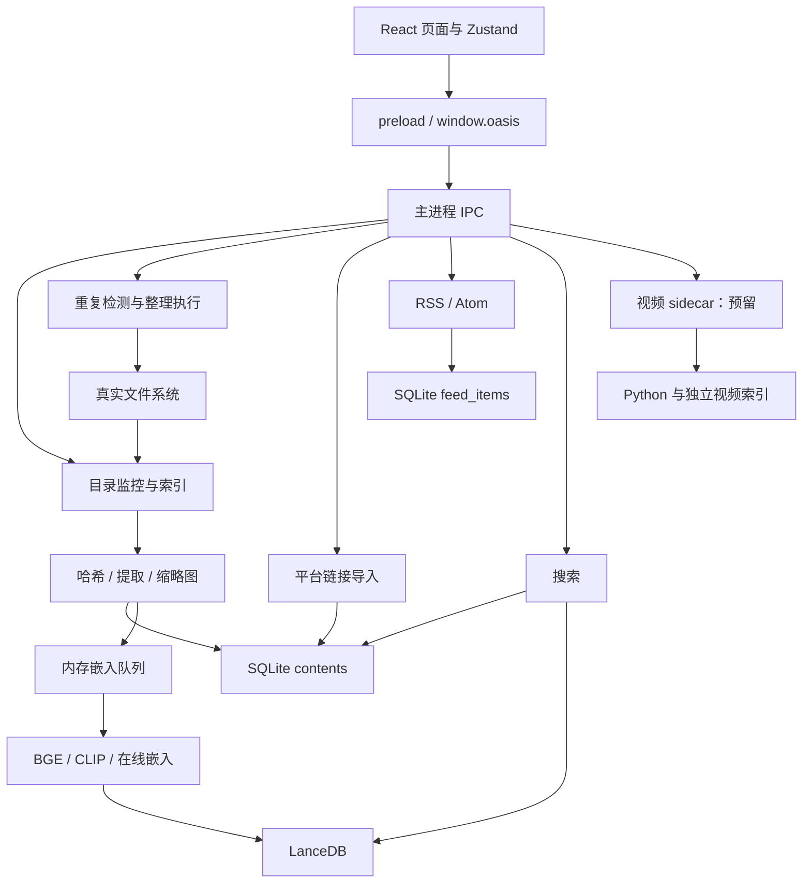
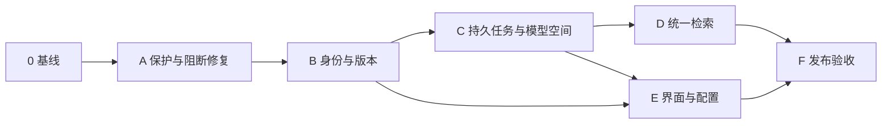

# Oasis Documents 完整整改计划与后续开发建议

> 文档日期：2026-09-06  
> 审查基线：当前工作区源码，应用版本 `0.1.0`  
> 文档状态：实施计划，尚未执行整改  
> 适用范围：现阶段优先支持 macOS Apple Silicon；其他平台在单独验证后承诺支持  
> 计划目标：把现有功能推进为文件操作安全、索引状态可信、检索链路完整、可持续迭代的桌面应用。

## 1. 决策摘要

当前项目已经具备 Electron、React、SQLite、LanceDB、本地模型、平台解析器和 RSS 的基础结构，可以在现有技术栈上整改。优先工作是修正数据身份、持久任务、文件操作与模型索引之间的关系，并完成已经对用户展示的功能链路。

实施顺序：

1. 修复现有入口的阻断和误操作风险，建立回归测试及数据备份基线。
2. 明确文件资产、物理位置、内容版本和来源归属，完成兼容迁移。
3. 建立可恢复的索引任务，修正模型预处理、向量空间和完成状态。
4. 接通文本、图片、平台收藏、订阅的统一检索。
5. 修正界面状态、配置、安全存储与安装包交付问题。
6. 根据实际使用反馈推进 OCR、阅读、规则归档、批量导入等后续功能。

**稳定版发布的硬条件：**原文件不被未经明确处理的目标冲突覆盖；内容不能因单个副本消失而被错误隐藏；过期任务不能复活已移除的资产；只有真正持久化成功的索引才能显示成功；不同模型空间的向量不能混写、混查。

本文给出的排期、性能目标和质量指标均为建议目标，不代表已经达到的实测结果。未勾选的任务均待开发或待验证。

## 2. 审查依据与结论边界

### 2.1 已完成的审查

- 阅读产品需求、架构、技术调研、模型比较和视频设计文档。
- 核对主进程、preload、共享接口、主要 React 页面与核心业务调用链。
- 在隔离副本中执行类型检查和生产构建，结果通过。
- 执行现有组件冒烟，图片处理、人工向量检索及哈希一致性通过。
- 使用临时文件、内存 SQLite、临时 LanceDB 和依赖替身验证特定业务缺陷。
- 审查期间没有修改项目业务源码，没有访问用户应用数据库。

### 2.2 证据级别

| 标记 | 含义 | 使用方式 |
| --- | --- | --- |
| A | 已用实际源码或当前依赖做隔离复现 | 可直接转为回归案例；仍须补充应用级验证 |
| B | 代码和调用链可以确定的问题 | 修复前增加最小失败用例，避免依赖文字判断 |
| C | 竞态、规模或运行环境相关风险 | 先设计验证实验，再决定实现范围 |
| F | 产品计划中的能力尚未形成完整流程 | 应明确为待开发，不能计为当前已交付能力 |

函数级复现不等于普通界面操作必然触发。例如 `safeMove()` 的覆盖与同路径删除已经复现，但当前 macOS 整理页面主要调用废纸篓清理，规则移动和撤销尚未完整接入界面。该问题是相关执行能力启用前的阻断项。

### 2.3 尚未验证的事项

- 小红书、抖音、公众号、CSDN 的实时解析成功率及长期稳定性。
- 真实模型在项目数据上的中文检索质量、召回率与资源占用。
- 正式 DMG/ZIP 的签名、公证、安装、升级和其他机器运行情况。
- 视频 sidecar 的完整环境安装、索引、检索、播放与异常恢复。
- Windows/Linux 的回收站、路径、原生依赖与安全存储行为。

现有 `e2e-smoke.cjs` 主要是组件冒烟，不能作为完整桌面用户流程的端到端验收。

## 3. 当前架构与主要断点

### 3.1 运行架构

项目是业务集中在 Electron 主进程的模块化单体。Electron 渲染进程负责界面，preload 暴露有限接口；主进程负责文件、数据库、模型、网络请求与任务调度；视频通过独立 Python 子进程处理。文档中的“Electron 单进程”应修订为“业务主进程集中式架构”。



### 3.2 内容来源的实际完成度

| 来源 | 现有处理链路 | 当前缺口 |
| --- | --- | --- |
| 本地文件 | 监控、哈希、提取、元数据、异步嵌入 | 身份混用、部分格式误提取、任务状态不可靠 |
| 平台收藏 | 解析网页、首图缓存、标签、写入 contents | 未进入嵌入队列，默认不被待索引补扫选择 |
| RSS/Atom | feed 解析、短摘要、时间线、已读和星标 | 保存在独立 feed_items，未进入统一搜索 |
| 本地图片 | 缩略图、EXIF、CLIP 图片向量 | OCR 未接入；文搜图入口未正确连接 |
| 本地视频 | 元数据和抽帧缩略图 | 语义检索、播放定位和环境管理尚未闭环 |

### 3.3 根本问题

1. **资产与内容指纹混用。**单一 `source_path` 与全局唯一 `hash` 无法表达实际文件清单，文件修改又通过删旧建新处理。
2. **派生数据没有统一生命周期。**contents、file_hashes、重复组、缩略图、向量和操作日志各自更新。
3. **任务状态缺少持久化依据。**内存队列、完成计数、SQLite 标记、LanceDB 写入不是同一个可靠提交过程。
4. **向量空间缺少身份和版本。**模型名称不足以描述模型、分词、池化、维度、预处理组成的完整索引协议。
5. **业务接口没有形成可靠契约。**IPC 接口、数据库字段、前端类型与真实返回值存在差异，类型断言掩盖了问题。
6. **功能展示领先于完整流程。**可撤销、统一订阅检索、规则归档、OCR、视频等需要明确完成边界。

## 4. 整改目标与优先级

### 4.1 优先级定义

| 优先级 | 定义 | 执行原则 |
| --- | --- | --- |
| P0 | 文件或索引数据可能被错误覆盖、破坏，属于对应能力的发布阻断 | 先增加保护；修复前相关操作不可作为稳定能力发布 |
| P1 | 主要用户流程失败、数据不一致、关键配置或搜索不可信 | 本轮稳定化必须完成 |
| P2 | 体验、可维护性、资源效率或次要能力缺口 | 依据依赖在稳定化后半段或下一轮完成 |
| F | 后续产品能力 | 有独立需求、质量目标和验收后再开发 |

### 4.2 全程必须成立的约束

- 相同内容的不同物理文件必须能在文件清单中被分别识别；哈希去重不能让物理文件记录消失。
- 对同一路径的多次监控不能产生重复资产；移除一个监控根不能误清其他根仍管理的资产。
- 文件更新保留稳定资产 ID 和用户标注；旧内容版本不得覆盖新版本。
- 用户原文件与用户标注属于必须保护的数据；向量、全文索引、缩略图属于可重建派生数据。
- 索引任务采用可重试、幂等处理；不假定文件系统、SQLite 和 LanceDB 可以跨系统原子提交。
- 删除和移除必须有版本或代际屏障；晚到的计算结果不能重新激活失效资产。
- 搜索只返回仍有效的资产及内容版本；失效向量不能长期占据结果名额。
- 网络失败、模型缺失、格式不支持、超时和取消必须有不同状态。
- UI 的成功、失败和进度来源于真实任务状态；不能通过超时直接改成“完成”。

## 5. 问题登记表

表内阶段 A—F 对应第 7 节。完成任务时需回填提交、测试和验收记录。

| ID | 问题 | 优先级 / 证据 | 主要影响 | 目标阶段 |
| --- | --- | --- | --- | --- |
| R01 | async 回调传入 SQLite 同步事务 | P1 / A | 有效非空目录重复扫描报错，失败后仍可能部分写入 | A |
| R02 | 目录删除按字符串前缀匹配 | P0 / A | 移除 work 时误清 work-old 的索引和缩略图 | A |
| R03 | safeMove 覆盖目标、相同路径删除源 | P0 / A，函数级 | 规则执行和撤销启用后的原文件风险 | A |
| R04 | contents.hash 唯一且只保存一个路径 | P1 / B | 相同内容副本无法完整列出 | B |
| R05 | 文件修改删旧记录再建 ID | P1 / B | 标签、用户状态与资产关联不稳定 | B |
| R06 | watcher 定时器与在途任务取消不完整 | P1 / B、C | 移除目录后仍可能重新入库 | A、C |
| R07 | 哈希缓存和重复组不清旧、不更新 | P1 / A、B | 重复组累积、过期清理建议 | A |
| R08 | 撤销日志和界面不完整 | P1 / A、B、F | “可撤销”承诺无法兑现，批次字段不一致 | A、E |
| R09 | MIME 规则转义错误及规则入口缺失 | P2 / A、F | image/* 不匹配；规则流程无法正常使用 | A、后续 |
| R10 | 在线服务商 enabled 未被界面设置 | P1 / B | 填写 Key 后仍静默使用本地模型 | A |
| R11 | 无本地 BGE 时在线就绪判断错误 | P1 / A，替身隔离 | 在线模式无法为文本建索引 | A |
| R12 | 不同文本模型向量混入同表 | P0 / A、B | 维度截断或补齐、查询失败、语义空间错误 | A、C |
| R13 | CLIP 近似分词与 BGE 池化不规范 | P1 / B，官方规范对照 | 向量表达偏离模型协议 | C |
| R14 | 向量写入缓冲后即标记成功 | P1 / A，替身隔离 | 崩溃后显示完成但没有向量 | C |
| R15 | 补扫固定前 500 条且先限量后过滤 | P1 / A，替身隔离 | 大批任务遗漏或就绪任务饥饿 | C |
| R16 | 向量表自愈删除后没有全量补偿 | P1 / B | 历史向量消失但内容仍标已索引 | C |
| R17 | 进度停滞被强制转为完成 | P1 / A，时钟隔离 | 成功数为零却显示 100% | C、E |
| R18 | 文搜图界面调用普通文本搜索 | P1 / B | 预期的 CLIP 图文检索未实际执行 | D |
| R19 | 平台收藏不进入嵌入队列 | P1 / A、B | 收藏仅被关键词检索 | D |
| R20 | RSS 未进入统一内容与搜索链路 | P1 / B、F | 时间线可见，搜索不可见 | D |
| R21 | 切片重复加分与距离百分比失真 | P1 / A、B | 排名失真，可出现负百分比或超过 100% | D |
| R22 | 列表全库分页后才按目录/类型过滤 | P1 / B | 有文件却显示为空，计数不可信 | E |
| R23 | 标记已读更新所有订阅的未读数 | P1 / A | 多订阅计数被同值覆盖 | A |
| R24 | 订阅筛选读取旧 React 状态 | P2 / B | 筛选结果落后一拍 | E |
| R25 | 二进制文档按 UTF-8 读取、.ts 判视频 | P1 / A、B | 乱码入库、代码全文缺失 | B |
| R26 | API Key 随配置 JSON 明文持久化 | P1 / A、B | 已有加密接口未实际应用 | A、E |
| R27 | IPC 类型、字段、数组结构不一致 | P1 / A、B | 构建通过仍发生运行期错误 | B、E |
| R28 | 模型冷启动重复初始化、并发不统一 | P2 / A，替身隔离；资源影响待测 | 多会话加载、并发放大和等待堆积 | C、F |
| R29 | OCR、阅读、视频等展示或文档超前 | P2 / F | 用户预期与实际能力不一致 | E、后续 |
| R30 | RSS 用 URL 全局主键抹掉第二来源 | P1 / A | 同文章在多个订阅中的归属丢失 | B、D |

## 6. 建议目标架构

### 6.1 服务职责

保持单机部署，逐步让 IPC 处理器退回到参数校验、调用服务和返回 DTO 的职责。以下为建议新增或重整的职责名称，并非声称当前已经存在这些模块。

| 服务职责 | 负责内容 | 不应继续承担的工作 |
| --- | --- | --- |
| 内容服务 ContentService | 资产、来源、版本、标签、删除与移除语义 | 模型推理和文件移动细节 |
| 文件操作服务 FileOperationService | 冲突检查、安全移动、废纸篓、操作日志与恢复 | 依靠 watcher 猜测操作是否完成 |
| 导入服务 IngestionService | 各来源归一化、提取结果、产生索引任务 | 各平台直接维护独立完成状态 |
| 索引调度器 IndexScheduler | 领取任务、租约、并发、重试、取消、持久化确认 | 通过 UI 计数决定任务成功 |
| 模型注册服务 ModelRegistry | 模型空间、配置验证、初始化、销毁、下载校验 | 自动把不同模型结果写进同一空间 |
| 搜索服务 SearchService | 范围过滤、多路召回、文档聚合、摘要、降级说明 | 把原始距离直接显示为概率 |
| 设置与凭据服务 SettingsService | 配置迁移、有效配置、密钥引用和安全存储 | 将完整明文配置返回给页面 |

### 6.2 数据身份的推荐决策

优先满足“真实文件清单完整”和“用户标注稳定”这两个产品目标：

- **每个独立物理文件默认拥有独立稳定的资产 ID。**两个路径上字节相同的文件都出现在列表中。
- 同一物理路径被多个监控根覆盖时，记录监控归属，不重复创建资产。
- 哈希用于重复分组和提取/嵌入计算缓存，不再作为资产主表的全局唯一条件。
- 同内容聚合展示可以做成视图；不要默认合并两个文件的用户标签、笔记或来源历史。
- 文件更新新增内容版本，保留资产 ID；准确识别到重命名时只更新位置。
- inode/device 等信息仅作为匹配线索，不能跨卷、长期或单独作为全局身份依据。

这一方案比“相同哈希只保留一条内容记录”更适合当前文件管理定位，也避免副本内容变化后标签归属不清。

### 6.3 逻辑数据模型

下表用于明确职责和约束。开发时可以在保持这些约束的前提下复用旧表，不要求一次性创建所有物理表。

| 实体 | 核心字段或关系 | 必须成立的约束 |
| --- | --- | --- |
| contents / assets | 稳定 ID、source_kind、media_kind、title、用户标签、状态 | 保留旧 ID；来源类型和媒体类型分开；移除 hash 全局唯一限制 |
| file_locations | location_id、content_id、规范路径、存在状态、文件指纹 | 活跃规范路径唯一；支持缺失、离线和已移除状态 |
| watch_memberships | location_id、watch_root_id | 一个根移除后，有其他有效归属的资产仍保留 |
| content_revisions | revision_id、content_id、hash、size、mtime、提取版本和结果 | 旧任务结果只属于旧版本，不能覆盖新版本 |
| source_links | content_id、平台、规范 URL、来源对象键、订阅归属 | URL 去重与来源归属分开处理 |
| chunks | revision_id、chunker_version、chunk_index、文本、位置 | 可复建；相同版本和切片策略产生确定性 ID |
| embedding_spaces | space_id、provider、endpoint、model_revision、dimensions、预处理指纹 | 一个物理向量表只对应一个已验证空间 |
| index_jobs | job_id、目标版本、space_id、stage、status、attempt、lease、next_retry | 唯一任务键防重复；状态可跨进程重启恢复 |
| index_generations | 资产版本、空间、generation、预期/实际记录数、发布状态 | 查询只使用通过校验且有效的一代索引 |
| file_operations | operation_id、batch_id、源/目标、指纹、阶段、真实回收位置、结果 | 修改文件前先记录意图；日志足以判断重试与恢复 |
| settings / credentials | 版本化配置、credential_ref、加密值 | 模型身份不包含密钥；普通配置不含明文 Key |

来源文章是否在全局搜索中聚合为一个结果，应由产品规则决定；无论如何必须保留它在不同订阅、收藏中的归属和状态。

### 6.4 索引任务与一致性协议

建议任务状态：

```text
pending → running → persisting → succeeded
             ├→ retry_wait → pending
             ├→ failed
             ├→ blocked（模型缺失、源暂不可读等）
             ├→ cancelled
             └→ superseded（已有更新版本）
```

执行规则：

1. SQLite 在同一个事务中提交资产版本与待处理任务。
2. 调度器以租约领取任务；领取条件包括来源有效、版本有效、所需模型可用。
3. 提取与推理可以重复执行，但记录 ID 和发布过程必须幂等。
4. 向量写入缓冲后，任务保持 `persisting`，不计成功。
5. 实际写入确认后校验记录数、空间和版本，再在 SQLite 中发布索引代际。
6. 发布操作带条件更新：资产仍有效、版本仍当前、取消代际未变化。
7. 进程在向量写完、状态提交前崩溃时，重试应识别或覆盖同一代记录，不能重复插入。
8. 已失效但迟到的向量允许作为待清理派生数据短暂存在，搜索不能将其返回；召回不足时补取候选。
9. 定期对账有效资产、成功任务与向量记录；孤立记录清理和缺失索引补建分别处理。

该协议采用“持久任务 + 幂等执行 + 条件发布 + 对账恢复”，不承诺跨文件系统、SQLite、LanceDB 的分布式事务。

## 7. 分阶段实施计划

### 阶段 0：建立实施和验证基线

**目的：**让后续每项修复都有可复现输入、验证结果和回退依据。

- [ ] 确认项目版本管理位置；当前目录未发现 Git 仓库，实施前建立或纳入明确的版本管理流程。
- [ ] 保存依赖锁文件与运行环境清单，记录 Node、Electron、系统架构和原生模块版本。
- [ ] 建立临时 userData、测试数据库和测试目录夹具，默认禁止测试连接真实应用数据。
- [ ] 将审查中的复现脚本转成可重复运行的回归测试；避免测试只复制实现表达式。
- [ ] 增加明确的测试入口，区分纯函数、数据库、任务恢复、Electron IPC 和界面流程。
- [ ] 记录现有数据库版本、表结构、索引目录与缓存布局，形成迁移清单。
- [ ] 确定第一轮验收机器和数据集，所有性能测试记录同一套条件。

**交付物：**测试夹具、基线报告、环境清单、数据库迁移设计草案。

**退出标准：**在干净测试目录可运行基线测试；能复现 R01/R02/R03/R12/R23 等核心缺陷；测试不会改用户文件。

### 阶段 A：修复阻断与误操作风险

**依赖：**阶段 0。  
**覆盖：**R01、R02、R03、R06、R07、R08、R09、R10、R11、R12、R23、R26 的即时保护。

#### A1. 文件操作与目录边界

- [ ] 修复重复扫描：异步计算与同步批量事务分离；扫描失败返回明确范围及失败数。
- [ ] 目录判断使用规范化后的路径与目录边界，覆盖相邻前缀、尾分隔符、根目录和转义字符。
- [ ] 删除监控根前清理该 watcher 的新增、删除定时器，并使其在途提交失效。
- [ ] safeMove 拒绝或明确跳过同一物理文件，不能仅比较路径字符串；覆盖符号链接、硬链接、大小写别名测试。
- [ ] 目标冲突默认跳过并报告；只有显式选定冲突策略才生成新目标，不静默覆盖。
- [ ] 复制使用独占目标或等效的不覆盖策略；不要假定普通 `rename()` 自带“不覆盖”保证。
- [ ] 复制完成校验内容指纹；源在操作期间发生变化时保留源并返回冲突。
- [ ] 修改磁盘前记录持久操作意图，完成每一阶段后更新日志。
- [ ] 用户确认过的清理建议在执行前重新校验目标文件与保留副本；旧扫描结果不能直接授权删除后来变化的文件。

#### A2. 重复组与撤销基本一致性

- [ ] 每次扫描使用 scan_id 或扫描代际，明确扫描范围，清理该范围内确认已消失的旧哈希。
- [ ] 扫描未完成、目录离线、无权限时，不把“未扫到”当作“已删除”。
- [ ] 重复组使用确定性组键更新；重复运行不追加相同 pending 组。
- [ ] 清理完成后同步哈希、重复组、资产、缩略图引用与向量失效状态。
- [ ] 修正批次返回字段，清理提示与实际撤销能力保持一致。
- [ ] 修正规则 MIME 转义，并为路径条件、相对时间、目标模板补充边界案例。

#### A3. 配置和索引保护

- [ ] 明确“选为默认服务商”和 enabled 的关系；保存后返回实际生效 provider。
- [ ] 修复在线就绪判断，使没有本地 BGE 的在线模式也能入队。
- [ ] 增加配置健康检查与清晰错误；测试 Key 时不索引真实文件。
- [ ] 向量写入前验证维度、有限数值、输出条数和目标空间；不合格输出在应用层拒绝。
- [ ] 在完整空间迁移完成前，阻止新配置向不兼容旧表写入；搜索可继续提供关键词结果并说明状态。
- [ ] 修复订阅未读数的更新范围，必要时从条目表重新计算所有源的计数。
- [ ] 停止新增明文密钥，接通凭据服务；旧值迁移按第 8 节执行。

**交付物：**即时修复、文件操作前置校验、重复扫描回归、有效配置返回与基础索引守卫。

**退出标准：**R01/R02/R03/R10/R11/R23 的回归通过；扫描失败不再产生失控后台写入；所有目标冲突均可见且不破坏已有文件；不兼容向量被拒绝。

### 阶段 B：数据身份、提取能力和接口统一

**依赖：**阶段 A 的文件安全保护及已批准的数据迁移设计。  
**覆盖：**R04、R05、R25、R27、R30。

- [ ] 按第 6.2 节确定资产身份规则，保留旧内容 ID 和用户标签。
- [ ] 去掉 hash 对资产的全局唯一约束，补充位置与监控归属。
- [ ] 实现文件版本更新，区分原文件修改、重命名、复制、替换和暂时离线。
- [ ] 建立统一的来源类型、媒体类型和提取能力枚举。
- [ ] 提取器返回结构化状态：成功、部分成功、不支持、失败，而非统一退化为空文本成功。
- [ ] 将支持能力拆为“能列出 / 能预览 / 能提取文本 / 能 OCR / 能嵌入”，形成能力矩阵。
- [ ] `.ts` 默认按代码文本处理；需要支持 MPEG-TS 时通过内容检测或显式覆盖解决歧义。
- [ ] 对 `.doc`、`.xlsx`、`.pptx`、`.pages` 等没有真实解析器的格式标为暂不支持全文；禁止按 UTF-8 导入乱码。
- [ ] 对大文件采用读取上限或流式处理，避免先完整读取再截断；具体阈值由负载测试确定。
- [ ] 提取失败保留元数据、原因和重试入口；不能把元数据已入库等同于全文索引成功。
- [ ] 统一 IPC 请求/响应 DTO、字段命名、数组返回和进度事件。
- [ ] 前端通过明确适配器使用 DTO，减少 `as unknown as` 等跨层断言。
- [ ] RSS 条目来源键包含订阅上下文；同 URL 可以聚合展示，但不能抹掉来源关系。

**交付物：**兼容迁移、新身份与版本模型、提取器能力矩阵、共享 DTO 与运行时校验。

**退出标准：**相同内容的两个文件均可见；删除一个不影响另一个；编辑后 ID 和标签保持；同文章多来源归属正确；不支持格式不会被标成全文提取成功。

### 阶段 C：可靠索引与模型空间

**依赖：**阶段 B 的稳定资产、内容版本和接口。  
**覆盖：**R12、R13、R14、R15、R16、R17、R28。

#### C1. 模型规范与空间注册

- [ ] 使用与模型权重匹配的 tokenizer、词表和 BPE merges；禁止未知词随机或哈希映射到普通词表位置。
- [ ] BGE 按实际模型输出及官方配置确定 CLS 池化；CLIP 按模型处理器规定处理图片和文本。
- [ ] 通过张量名称和形状选择模型输出，不依赖 `Object.values(res)[0]` 的顺序假设。
- [ ] 文本截断按 token 上限执行，避免中文长段、英文长词造成越界。
- [ ] 保存模型空间指纹：提供方、服务端点、模型版本、向量维度、tokenizer、池化、图片预处理和归一化规则。
- [ ] 模型下载固定版本或可追溯 revision，校验文件完整性；失败支持重试，状态不能只凭文件存在判断。
- [ ] 初始化使用共享 Promise，同一空间的并发请求只初始化一次；配置失效后受控释放旧会话。
- [ ] 本地/在线降级只查询各自匹配的空间；没有匹配索引时退到关键词，并告知用户。

官方模型规范参考：[BGE 模型说明](https://huggingface.co/BAAI/bge-small-zh-v1.5#using-huggingface-transformers)、[CLIP 分词实现](https://github.com/openai/CLIP/blob/main/clip/simple_tokenizer.py)、[CLIP 图片处理实现](https://github.com/openai/CLIP/blob/main/clip/clip.py)。模型质量还需本项目的标注检索集验证。

#### C2. 持久任务和恢复

- [ ] 实现第 6.4 节状态机和条件发布，不再在内存缓冲阶段标记完成。
- [ ] 提取、推理和写入分阶段限流；使用全局并发额度，避免每个批次各自放大并发。
- [ ] 查询有独立调度优先级，长批量索引不能一直占满交互请求资源。
- [ ] 超时会结束或隔离底层工作；不能只让外层 Promise 超时而持续堆积原任务。
- [ ] 补扫按可执行任务领取并持续翻页，处理 500 条后的剩余任务，避免不可执行类型阻塞其他任务。
- [ ] 失败任务区分重试、阻塞、永久不支持，并设置退避、次数上限和人工重试入口。
- [ ] 队列、缓冲、写入锁和数据库关闭按统一顺序退出；未完成任务在下次启动恢复。
- [ ] 移除资产或更新版本时，使在途任务无法发布旧结果。
- [ ] 向量损坏时登记受影响空间并产生完整重建计划；不能直接删表后继续宣称历史索引成功。
- [ ] 对账任务检查内容版本、成功任务、索引代际和记录数；清理派生数据需可追溯。

**交付物：**模型空间注册、持久任务调度器、索引恢复、真实进度、故障注入测试。

**退出标准：**六个并发冷启动请求只创建一套对应会话；混维度在写入前被拒绝；超过 500 条可连续处理；写入期间退出后重启可以恢复；过期结果不被搜索返回；超时不显示成功。

### 阶段 D：统一检索与来源接入

**依赖：**阶段 B、C。  
**覆盖：**R18、R19、R20、R21、R30。

- [ ] 为全部内容、文搜图、以图搜图提供明确请求模式并贯通 UI、preload、IPC、服务和空间路由。
- [ ] 定义“全部内容”是否同时召回图像空间；首个稳定版本建议文本查询可同时召回文本与图片，分别显示命中依据。
- [ ] 平台内容保存后通过统一入库服务产生索引任务；存量收藏做版本化回填。
- [ ] RSS 条目建立内容关联，标题和现有摘要先可搜；完整正文在后续抓取成功后产生新内容版本。
- [ ] 同文章的多个来源可在结果中聚合展示，并保留收藏、订阅归属和阅读状态。
- [ ] 检索范围统一支持目录、类型、平台、时间和来源；过滤在候选召回时生效，不能在最终 top-K 后简单丢弃。
- [ ] 在全文检索方案上先验证 SQLite FTS5 和中文查询策略；保留短词、文件名、路径的明确匹配规则。
- [ ] FTS 查询表达式转义或构造受控 AST，区分普通用户文字与高级查询语法。
- [ ] 文档切片先聚合成文档结果；多切片命中不冒充多召回通道加分。
- [ ] 优先评估按排名融合等不直接混合不同量纲分数的方法，参数通过标注集选择。
- [ ] 显示实际命中片段和来源；取消将原始距离作为“相关概率百分比”的展示。
- [ ] 对模型缺失、在线失败、索引建设中分别说明当前搜索覆盖范围。
- [ ] 无有效图像模型时，以图搜图返回可操作的状态，不能装作正常得到零结果。

SQLite FTS5 提供全文索引、排序与命中片段能力，但中文切词、短查询和子串行为需要用当前安装版本验证；不能假定默认 tokenizer 自动满足中文搜索需求。参考：[SQLite FTS5 官方文档](https://www.sqlite.org/fts5.html)。

**交付物：**统一搜索请求、来源入库桥接、全文与向量召回融合、结果解释、检索评测集。

**退出标准：**本地文档、图片、平台收藏和订阅样例均能通过对应模式检索；模式确实使用正确模型空间；重复切片不制造重复结果或异常高分；过滤后的结果与计数一致。

### 阶段 E：用户流程与配置收口

**依赖：**阶段 B 的 DTO，阶段 C/D 的状态和检索接口。  
**覆盖：**R08、R17、R22、R24、R26、R27、R29。

- [ ] 文件列表在后端先按目录和类别筛选，再排序分页；总数和分类计数来自同一过滤范围。
- [ ] 分页排序增加稳定的次级键；导入、删除时保证分页刷新策略明确。
- [ ] 订阅筛选改为状态驱动请求或传入显式参数，增加旧请求结果失效处理。
- [ ] 已读、星标、退订后的计数和列表立即一致；局部失败不显示全局刷新成功。
- [ ] 导入进度按任务阶段显示已完成、处理中、待模型、失败和取消；保留可查询的完成报告。
- [ ] 模型下载和初始化分别显示状态；支持损坏后修复或重新下载。
- [ ] 先完成有真实恢复能力的操作历史与撤销 UI，再恢复“可撤销”文案；不支持的操作显示真实恢复方式。
- [ ] 明确“停止监控”“从库中移除”“移入废纸篓”三个动作的不同后果。
- [ ] 添加全局搜索快捷键并验证焦点与取消行为；清理未使用的旧搜索状态分支。
- [ ] 收藏与搜索结果提供明确的打开原文、打开位置或预览动作。
- [ ] 对外链采用明确的协议与导航策略；在主进程打开允许的链接，不让行为依赖默认新窗设置。
- [ ] 密钥仅在主进程解密，设置页只显示掩码、已配置状态、替换和清除入口。
- [ ] 配置文案区分“数据保存在本机”和“用户启用在线处理后会发送所需内容”；显示实际使用的提供方。
- [ ] 未完成的 OCR、纯净阅读、批量导入、自动同步和视频能力标明状态，不能作为已生效功能。

安全存储与外链 API 的行为需按实际目标平台验证。参考：[Electron safeStorage](https://www.electronjs.org/docs/latest/api/safe-storage)、[Electron shell](https://www.electronjs.org/docs/latest/api/shell)。本轮审查没有证据证明普通外链页面获得了项目 preload 权限，不将其列为已证实的远程执行漏洞。

**交付物：**完整用户流程、真实状态文案、设置和凭据交互、操作历史及错误恢复入口。

**退出标准：**切换目录和筛选无假空列表；连续快速切换筛选不回显旧结果；未读和星标准确；Key 不以明文出现在普通配置返回和新日志中；不可用能力有正确说明。

### 阶段 F：负载、迁移和安装包验收

**依赖：**A—E 的主要流程已完成。

- [ ] 在目标设备上测量冷启动、模型初始化、批量提取、查询和空闲资源占用。
- [ ] 用真实负载确定推理、下载、提取、向量写入并发，不按 CPU 数量直接推导总并发。
- [ ] 对同步热点做分析：重复图片两两比较、DCT、长文本处理和大 SQL 查询。
- [ ] 确认会阻塞交互的计算后，再迁移到 worker 或 utility process；明确其崩溃恢复协议。
- [ ] 对模型加载、原生模块失败、数据库锁、磁盘空间不足和缓存不可写做故障验证。
- [ ] 构建并安装正式 DMG/ZIP，验证原生模块解包、ffmpeg 位置、资源路径和离线启动。
- [ ] 验证升级迁移及回退；开发构建通过不能替代安装包验收。
- [ ] 按发布方式配置签名与公证，核对首启权限和系统提示。
- [ ] 生成支持的系统、格式、模型、已知限制和迁移说明。
- [ ] 清理临时测试资源，保留脱敏测试报告与可复现脚本。

**交付物：**候选发布包、完整验收报告、迁移和恢复说明、能力矩阵、已知问题清单。

**退出标准：**第 9 节规定的发布门槛全部通过；P0/P1 没有未处理项；仍保留的 P2 有明确范围和不会误导用户的展示。

## 8. 数据迁移、索引重建与回退

### 8.1 数据保护分级

| 数据 | 处理原则 |
| --- | --- |
| 用户原文件 | 迁移不移动、不覆盖、不删除；文件操作另走可审计流程 |
| 标签、星标、已读、笔记、来源关系、操作历史 | 必须备份并验证迁移前后保持 |
| 平台正文缓存 | 视为需要保护的内容，不能假定原网页以后仍可访问 |
| 向量、全文索引、缩略图 | 可以重建，但重建期间必须说明覆盖范围 |
| API Key | 安全迁移；禁止在日志、报告、测试夹具中输出原值 |

### 8.2 迁移实施步骤

1. **记录基线。**统计资产、路径、来源、标签、订阅状态、重复组和操作日志；记录旧 schema 版本与应用版本。
2. **建立一致备份。**暂停后台写入，等待在途事务完成；使用数据库一致备份方式或完成 checkpoint 并关闭后备份，不能只复制运行中 WAL 数据库的主文件。
3. **新增结构。**采用有版本号、可重复执行的迁移，优先新增表和字段；涉及去掉 hash 唯一约束时，用事务内建新表、复制、核验、切换方式处理。
4. **保留旧 ID。**现有 contents.id、标签、来源和时间字段默认保留；迁移映射可追溯。
5. **回填位置和版本。**旧 source_path 回填到位置表；缺失路径保留缺失或待核验状态，不直接删除资产。
6. **找回旧逻辑漏掉的副本。**对仍启用的监控范围分批重新扫描。file_hashes 只能作为待验证候选，不能直接证明文件现在仍存在或仍是原内容。
7. **迁移订阅与收藏。**保留来源归属、已读和星标；为已有正文或摘要产生可恢复的索引任务。
8. **迁移凭据。**先写入加密凭据并在内存中验证可读，再从普通配置去掉明文字段；失败时保留可恢复状态，不默默丢 Key。
9. **登记旧索引。**旧向量的模型/预处理来源不确定时标记为 legacy，不依据当前设置猜测空间；不混入新表。
10. **建立新索引。**按确定的模型空间重建，校验记录数、有效版本和检索样例后切换。
11. **核对后发布。**检查身份映射、状态数量和抽样内容，迁移报告只有结构和脱敏计数。
12. **延后清理。**通过验收和保留期后再处理旧表、旧索引与备份，清理范围有明确记录。

旧明文 Key 可能仍存在于历史备份或旧 WAL 中。新存储方案的验收是“不再新增明文、当前有效配置不再保留明文”，不能把迁移描述为已清除所有历史介质副本。

### 8.3 迁移期间的可用性

- 文件列表、来源状态和关键词搜索优先保持可用。
- 新向量空间没有完成前，界面显示已覆盖与待处理数量。
- 只有可以确认兼容性的旧空间才可继续读取；无法确认的空间不用于语义结果。
- 重建失败允许重试当前空间，不要求重新导入用户全部内容。
- 长迁移有阶段进度和断点，重启后从已确认的迁移阶段继续。

### 8.4 回退分界

- **新版本尚未接受用户写入时：**可停止应用，恢复匹配的应用版本和迁移前数据库备份；用户原文件保持原位。
- **新版本已经产生标签、收藏、订阅状态或文件操作时：**不能直接恢复旧备份覆盖新数据；先导出或迁移新增记录与操作历史，执行经验证的兼容回退或前向修复。
- 结构回退与文件撤销是不同操作，不能把回滚数据库当作恢复磁盘文件。
- 文件系统发生过移动或清理时，以持久操作日志和现存指纹逐项恢复；目标冲突必须报告，不能覆盖。
- 每次正式迁移前，在数据库副本上完成一次恢复演练并记录结果。

## 9. 验收与测试矩阵

### 9.1 功能与数据安全

| 测试 ID | 场景 | 必须满足的结果 |
| --- | --- | --- |
| T01 | 非空目录、不可读文件、空目录重复扫描 | 不出现 async transaction 错误；失败范围明确；无失控后台写入 |
| T02 | work、work-old、含 %/_ 的路径和嵌套监控根 | 只影响目标范围；其他有效监控归属保留 |
| T03 | 相同路径、硬链接/符号链接别名、目标重名 | 不删除唯一文件、不覆盖目标；返回明确跳过或冲突 |
| T04 | 文件复制途中变更、磁盘满、权限失败 | 源保留；不把部分目标当成功；残留由操作记录可识别 |
| T05 | 扫描后重复文件被修改或保留副本消失 | 执行前校验拒绝过期建议 |
| T06 | 两个相同文件，删除或编辑其中一个 | 两个资产最初都可见；另一文件与标注不受损 |
| T07 | watcher 提取期间移除目录、定时器尚未触发时移除 | 旧任务和晚到任务不能重新发布资产 |
| T08 | 连续扫描和清理同一批文件 | 组数不重复增长；清理后 pending 与缓存一致 |
| T09 | 只有在线模型、无本地 BGE | 实际 provider 正确；索引和查询均可工作 |
| T10 | 模型切换、在线失败降级、同维不同模型 | 空间严格隔离；不能混写混查；覆盖范围说明正确 |
| T11 | 向量维度错误、NaN/Infinity、输出数量不符 | 写入前拒绝，任务明确失败或重试 |
| T12 | 写向量前、写完后、发布前分别终止进程 | 重启恢复且不重复发布；无永久“成功但无索引” |
| T13 | 501/2000 条任务、前 500 条模型不可用 | 后续可执行任务仍能运行，剩余任务持续领取 |
| T14 | 损坏或缺失向量表 | 全受影响范围被登记重建，用户记录不丢失 |
| T15 | 六路并发模型冷启动、长任务与查询并行 | 初始化次数符合预期；查询不长期饥饿 |
| T16 | 平台收藏与订阅样例分别入库 | 均进入统一搜索；摘要与全文覆盖正确标注 |
| T17 | 500 条之外的目录内容、快速切换目录和类型 | 先过滤后分页；无假空列表、旧响应覆盖和错误总数 |
| T18 | A 未读 2、B 未读 3，读 A 一篇 | 结果为 A=1、B=3；重复操作保持幂等 |
| T19 | 同 URL 出现在两个订阅中 | 两个来源关系保留；源内过滤均可见 |
| T20 | .ts、.docx、.xlsx、扫描 PDF、损坏文档 | 依据能力矩阵处理；不支持不伪装提取成功 |
| T21 | 保存、替换、清除和迁移 Key | 普通配置与日志不出现明文；安全存储失败可恢复 |
| T22 | 撤销移动、回收站重名、恢复目标已存在 | 不覆盖新文件；恢复正确或返回明确不可恢复原因 |
| T23 | 升级迁移中断、重跑、兼容回退 | 用户状态保持，迁移幂等，恢复路径经过演练 |
| T24 | 干净机器安装正式包并离线首启 | 原生依赖加载正确；模型缺失有明确引导；不依赖开发目录 |

涉及磁盘操作的测试只使用临时目录；故障注入必须让测试进程、数据目录和清理范围可以明确识别。

### 9.2 检索质量验收

建立固定的、可版本管理的检索评测集，至少覆盖中文文档、截图、普通图片、代码、收藏和订阅摘要。模型选择与参数调整不使用最终验收集反复调参。

| 维度 | 建议验收方式 |
| --- | --- |
| 确定性检索 | 文件名、标题、精确短语等功能用例应全部通过 |
| 文本语义 | 至少 100 条人工标注查询，记录 Recall@10、MRR@10 和失败类型 |
| 文搜图 | 至少 50 条中文描述，区分可见文字、对象、布局和抽象主题 |
| 以图搜图 | 原图、缩放、裁剪、压缩、相似但不同内容分别测试 |
| 多来源检索 | 记录每类来源的独立覆盖率，不能用总体平均掩盖某来源为零 |
| 混合排序 | 检查多切片占位、重复来源、旧版本、分数展示和摘要位置 |
| 模型协议一致性 | 同样本与参考实现比较 token、张量形状和向量方向；量化模型容差单独确定 |

第一轮先建立有效基线并分析失败项，再冻结质量门槛；在没有数据集之前不承诺统一的召回率数字。每次更换模型、分词、池化或切片策略都视为新索引版本并重新评估。

### 9.3 性能建议目标

建议首先以 Apple Silicon、16GB 内存、SSD 为试验条件。实际目标机器未确定前，下表是待校准目标。

| 项目 | 建议初始目标 | 测量条件 |
| --- | --- | --- |
| 文件列表/过滤 | P95 ≤ 300 ms | 1 万条资产，返回一页，排除首次文件系统权限请求 |
| 关键词搜索 | P95 ≤ 500 ms | 1 万条已索引内容；固定查询集；记录文本总量 |
| 本地语义搜索 | P95 ≤ 2 s | 模型已预热，索引已建；同时报告查询编码与向量检索耗时 |
| 冷启动与模型初始化 | 独立报告，不能混入预热指标 | 模型未加载和已加载分别测量 |
| 批量索引 | 不先承诺每分钟文件数 | 按格式、大小、切片数和模型分别报告吞吐 |
| 取消响应 | 2 s 内界面确认取消请求已登记 | 实际底层停止或隔离耗时另行记录 |
| 资源回收 | 多轮导入/查询后无持续无界增长 | 测内存、会话数、队列长度、临时文件和空闲占用 |

测试规模建议分为 100 条功能集、1 万条混合集、10 万条元数据分页集。大规模元数据集不能冒充同等规模真实模型负载；报告必须说明有效文本量、图片量和向量条数。

### 9.4 发布门槛

- [ ] 所有适用 P0/P1 关闭，并能追溯到回归测试与验收证据。
- [ ] 文件覆盖、同路径、过期建议、移除竞态和恢复冲突用例通过。
- [ ] 模型空间、版本、索引记录和成功状态对账通过。
- [ ] 四类首期来源的可用能力与界面说明一致。
- [ ] 正式安装包在开发机以外的目标机器上通过测试。
- [ ] 迁移、断电/退出恢复与回退演练通过。
- [ ] 未支持能力在产品内明确标识；没有误导性的“已完成”“可撤销”“全部本地处理”。
- [ ] 测试和诊断日志脱敏，不包含原文、图片、Key 等不必要的用户内容。

## 10. 工作拆分、依赖与排期建议

### 10.1 建议工作量

估算假设：1 名熟悉 Electron/TypeScript 的主开发，能够获得产品验收支持；使用现有代码和依赖；包含必要测试与文档，不包含新视频功能、完整 Office 格式支持、L3 自动同步或跨平台交付。

| 阶段 | 估算人日 | 可并行部分 | 主要依赖 |
| --- | --- | --- | --- |
| 0：基线与测试环境 | 2–3 | 产品能力盘点 | 无 |
| A：安全和阻断修复 | 5–8 | 订阅计数、配置修复可与文件保护分开 | 测试基线 |
| B：身份、提取和 DTO | 8–12 | DTO 与提取器改造可分工 | 迁移设计、文件保护 |
| C：可靠索引与模型空间 | 10–15 | 模型规范验证可提前，任务实现依赖版本模型 | B |
| D：统一来源与搜索 | 7–11 | 收藏/RSS 接入与排序可分工 | B、C |
| E：流程与设置收口 | 5–8 | 已读筛选、列表、文案可分批推进 | 稳定 DTO 和任务状态 |
| F：发布与恢复验收 | 4–7 | 测试数据准备可提前 | A—E |
| **合计** | **41–64 人日** | 不等于日历工期 | 不包含不确定性缓冲 |

建议预留约 20% 的环境、模型、迁移和原生依赖问题缓冲，预算约为 49–77 人日。单人实施大致需要 10–16 个工作周；两名开发加验收支持可并行压缩，但应在阶段 0 完成后按关键路径重排，不能简单把工期除以人数。

### 10.2 里程碑依赖



可以提前验证模型规范和准备检索集，但新空间的正式发布、数据迁移和 UI 完成状态必须建立在稳定版本与任务协议上。

### 10.3 建议的提交/评审拆分

1. 测试隔离与失败案例。
2. 重复扫描事务、目录边界和文件操作保护。
3. 在线启用、就绪判断、订阅计数与凭据即时保护。
4. 资产/位置/版本 schema 和兼容迁移。
5. 提取能力矩阵与 IPC 契约。
6. 模型协议修正与空间注册。
7. 持久任务、取消、写入确认和恢复。
8. 搜索路由、文档聚合与索引覆盖说明。
9. 平台/RSS 统一入库及来源关系。
10. 列表分页、订阅状态、导入报告和操作历史。
11. 故障注入、性能和安装包验收。

每个提交应有单一评审主题、对应问题 ID、验证结果和迁移影响。数据库迁移不与大规模视觉改版混在同一变更中。

### 10.4 实施任务模板

```markdown
### 任务：<任务名称>

- 关联问题：Rxx
- 优先级：P0 / P1 / P2
- 当前状态：待实施 / 开发中 / 待验证 / 已完成
- 负责人：待分配
- 前置依赖：<任务或设计决策>
- 触发场景：<用户操作和必要数据条件>
- 当前行为：<可复现问题>
- 目标行为：<可验收结果>
- 修改范围：<模块和接口>
- 数据影响：<迁移、重建、用户状态保护>
- 验收案例：Txx
- 验证证据：<测试命令、输出、报告或提交>
- 回退方式：<代码和数据分别说明>
```

## 11. 后续开发建议

### 11.1 产品开发主线

后续功能围绕“收进来、找得到、读得懂、整理得安全”逐步推进。每个版本选择明确用户闭环，避免同时展开平台自动同步、大模型问答、视频分析和复杂归档。

### 11.2 建议版本路线

版本号为规划建议，实施时按实际发布节奏调整。

| 版本阶段 | 用户可感知的结果 | 必须先具备 | 建议范围 |
| --- | --- | --- | --- |
| 0.1.x 稳定化 | 已有导入、扫描、搜索和订阅行为可信 | 本文 A—F 的首期门槛 | 修复主流程、迁移、状态与安装包 |
| 0.2 文件与阅读 | 文件和文章可以在应用中理解与定位 | 稳定内容版本、来源关系、预览边界 | 详情页、PDF/图片预览、正文阅读、OCR |
| 0.3 整理闭环 | 用户审阅建议后可安全归档和恢复 | 安全执行器、完整操作日志、恢复验证 | 规则编辑、建议预览、冲突处理、批次历史 |
| 0.4 收藏与订阅扩展 | 多来源批量导入并持续更新 | 统一入库、去重和调度 | HTML/JSON/OPML 导入导出、RSS 定时刷新、缓存管理 |
| 0.5 检索增强 | 更好的中文、多模态与长文定位 | 固定质量基线与评测集 | 模型比较、重排序、相似内容、标签检索 |
| 实验功能 | 视频片段检索或账户同步 | 独立环境与可靠恢复 | 小范围启用，单独验收，不阻塞文件主流程 |

### 11.3 优先开发的能力

#### F01. 文件详情与内容预览

**价值：**用户知道搜到的是什么，减少反复跳转 Finder。

- 图片详情包含缩略图、尺寸、EXIF、OCR 状态和来源位置。
- 文档显示可用正文、页码或段落位置；不支持格式显示明确能力状态。
- 搜索命中跳到对应页或片段，保留打开原文件和显示位置动作。
- 验收：路径缺失、文件更新、预览失败均可恢复；预览不修改原文件。

#### F02. OCR 与扫描文档检索

**价值：**让截图、票据、扫描 PDF 和图中可见文字成为有效检索内容。

- 先处理中文截图与扫描 PDF 两类高频场景，独立记录 OCR 版本和状态。
- OCR 文本进入文本索引，同时保留原始图片向量，避免一种结果覆盖另一种表示。
- 保留页码、文本区域与置信信息；低质量 OCR 能重新处理。
- 在真实设备比较运行时、准确性和资源占用，再确定模型，不先承诺某个新模型最优。
- 验收：固定图文样例能够从文字命中定位到原页或图片。

#### F03. 纯净阅读与用户标注

**价值：**平台收藏和订阅从“外链清单”变成可持续使用的内容库。

- 正文提取、受控 HTML 渲染、阅读进度和已读状态。
- 高亮与笔记关联稳定资产及内容版本，正文更新后能识别失效锚点。
- 提供本地缓存、原文链接与抓取时间；不能假定外部网页永远可用。
- 验收：页面内容更新不导致笔记静默错位；不支持的正文能回退到原文。

#### F04. 规则归档与可信撤销

**价值：**实现需求中的“建议、确认、真实归档、可恢复”。

- 规则编辑器使用明确 schema，避免自行扩展不完整 YAML 解析造成不可预测匹配。
- 建议预览显示源、目标、理由、冲突和文件版本，执行前再验证。
- 分开处理精确重复与近似图片；近似关系只提供审阅线索，不默认等价为可删除副本。
- 操作历史支持逐项或批次恢复，并展示无法恢复原因。
- 如采用系统废纸篓，要验证实际恢复能力；系统无法提供稳定回收定位时，应限定承诺或设计明确的应用托管保留区及容量政策。
- 验收：目标冲突、源更新、跨卷、回收重名和部分失败均不导致错误覆盖。

#### F05. 批量导入导出与订阅维护

**价值：**降低整理历史收藏的成本，并让用户能迁出数据。

- 书签 HTML、明确格式的 JSON、RSS OPML 等逐类实现，附格式说明和样例。
- 导入提供预览、来源归属、重复处理与失败报告，支持中断继续。
- RSS 刷新接入持久调度，管理间隔、错误、禁用与退订，而非只增加一个全局定时器。
- 导出标签、来源、笔记和阅读状态；说明哪些缓存媒体包含在导出中。
- 验收：导出再导入不重复放大资产或丢失用户状态。

### 11.4 后置能力及进入条件

| 能力 | 后置原因 | 开始开发前的条件 |
| --- | --- | --- |
| L3 账户自动同步 | 登录态、平台变化和恢复成本高 | L1/L2 已稳定；有独立连接、同步日志和来源去重协议 |
| Newsletter / IMAP | 新增凭据、邮箱状态与消息来源模型 | 凭据服务、持久调度和批量导入成熟 |
| 视频语义检索 | 新运行时、较重模型、独立索引和播放器 | 文件主流程通过验收；有固定视频评测样例和资源预算 |
| 多模态大模型描述 | 存在成本、延迟与版本漂移 | 有明确高价值场景，并能与现有 OCR/CLIP 在评测集上比较 |
| 问答 / RAG | 上游召回不稳时答案难以可信 | 检索质量、片段引用、版本定位和来源覆盖已达标 |
| 跨设备同步 | 冲突、身份、凭据和多端状态复杂 | 本地身份与事件模型稳定，用户确有明确需求 |
| 自动删除或自动归档 | 对文件操作正确性要求最高 | 操作预览、审计、恢复和长期回归成熟；默认仍由用户确认 |

### 11.5 视频专项建议

视频功能保留为独立实验模块。恢复开发前先完成以下事项：

- [ ] 明确 sidecar 的 Python、依赖、模型、ffmpeg 和持久目录，正式包不能引用开发工作区。
- [ ] 以独立资源方式打包并验证实际路径；`resources/video-sidecar/bridge.py` 存在不等于安装包可调用。
- [ ] RPC 方法、返回字段、进度事件贯通主进程、preload、界面和播放器。
- [ ] 持久化片段任务和失败状态；文件部分完成不能误判整文件已完成。
- [ ] 真正实现重启与恢复；日志中写“重启”不能算完成恢复逻辑。
- [ ] 管理临时切片与索引删除，验证取消和进程退出后的清理。
- [ ] 检索结果能定位开始/结束时间，并通过受控媒体协议播放。
- [ ] 云端与本地后端分别记录成本、耗时、内存和质量；模型名称和服务规格重新核实。

## 12. 持续开发与维护建议

### 12.1 版本与文档

- PRD 中每项能力标注“已验收 / 开发中 / 规划中 / 暂不支持”，完成状态以用户流程验收为依据。
- 架构文档记录实际数据模型、任务协议和空间迁移，删去已经放弃的中间推导。
- 模型比较文档中的时效性参数、硬件要求、接口和性能声明在真正选型时重新验证。
- 记录重要设计决策：资产身份、相同 URL 聚合、文件移除语义、模型空间、回收方式和支持平台。
- 发布说明必须包含能力变化、迁移影响、已知限制与恢复方式。

### 12.2 测试与诊断

- 每个确定缺陷至少有一个防回归用例；修复恢复、并发、身份和磁盘操作时必须有有意义的场景测试。
- 日志关联 asset_id、revision_id、job_id、space_id、operation_id，避免只有模糊“失败”字符串。
- 提供索引状态页：待处理、处理中、模型阻塞、失败原因、覆盖范围、重试和诊断导出。
- 诊断导出默认脱敏；不采集不必要的正文、图片或 Key。
- CI 分层执行类型检查、构建、单元/集成测试；Electron 与原生依赖验收在匹配目标环境运行。
- 更新原生依赖、模型文件或数据库版本时单独做兼容性验证，不把依赖升级夹在普通功能修改里。

### 12.3 本轮建议暂缓的工作

- 大面积界面重设计：先修正确性和状态，让现有页面能够可信工作。
- 同时新增多个在线模型商：先把一个在线路径与本地路径完整验收。
- 自动账户同步和视频规模化：先完成本地文件、分享收藏、RSS 的统一链路。
- 对未经评测的模型做“最佳”“最强”等产品承诺：先建立本项目质量证据。

## 13. 首批可直接启动的任务

- [ ] 建立隔离测试和迁移备份流程，固化审查基线。
- [ ] 修复重复扫描同步事务问题，并验证失败后无后台残留写入。
- [ ] 修复目录边界，覆盖相邻前缀和嵌套监控根。
- [ ] 给文件操作加同文件判定、目标冲突保护和执行前指纹校验。
- [ ] 修复在线 enabled 与 readiness，返回实际生效模型。
- [ ] 加向量维度/数值/空间守卫，防止继续污染旧表。
- [ ] 修复订阅未读计数，重算已有派生计数。
- [ ] 阻止继续明文保存 Key，设计旧配置迁移。
- [ ] 冻结资产身份、任务状态、模型空间和回退协议。
- [ ] 按阶段 B 开始兼容迁移及接口收敛。

以上是开发计划，不代表已经实施。每完成一项，应按第 10.4 节任务模板补充实际负责人、验证证据和数据影响。

## 14. 项目文件索引

以下链接对应本次审查工作区。后续代码变化后应重新核对具体实现，不依赖历史行号。

| 范围 | 当前文件 |
| --- | --- |
| 产品需求 | [PRD.md](/Users/stanwu/develop/oasis-desktop/Oasis-documents/docs/PRD.md) |
| 现有架构 | [ARCHITECTURE.md](/Users/stanwu/develop/oasis-desktop/Oasis-documents/docs/ARCHITECTURE.md) |
| 技术调研 | [TECH_RESEARCH.md](/Users/stanwu/develop/oasis-desktop/Oasis-documents/docs/TECH_RESEARCH.md) |
| 模型比较 | [MODEL_COMPARISON.md](/Users/stanwu/develop/oasis-desktop/Oasis-documents/docs/MODEL_COMPARISON.md) |
| 主进程启动 | [index.ts](/Users/stanwu/develop/oasis-desktop/Oasis-documents/src/main/index.ts) |
| IPC 处理 | [ipc.ts](/Users/stanwu/develop/oasis-desktop/Oasis-documents/src/main/ipc.ts) |
| 共享接口 | [shared/ipc.ts](/Users/stanwu/develop/oasis-desktop/Oasis-documents/src/shared/ipc.ts) |
| 数据结构 | [db.ts](/Users/stanwu/develop/oasis-desktop/Oasis-documents/src/main/db.ts) |
| 文件监控 | [watcher.ts](/Users/stanwu/develop/oasis-desktop/Oasis-documents/src/main/indexer/watcher.ts) |
| 文件索引 | [pipeline.ts](/Users/stanwu/develop/oasis-desktop/Oasis-documents/src/main/indexer/pipeline.ts) |
| 内容提取 | [extractor.ts](/Users/stanwu/develop/oasis-desktop/Oasis-documents/src/main/indexer/extractor.ts) |
| 嵌入队列 | [embedding-pipeline.ts](/Users/stanwu/develop/oasis-desktop/Oasis-documents/src/main/indexer/embedding-pipeline.ts) |
| 本地模型 | [local.ts](/Users/stanwu/develop/oasis-desktop/Oasis-documents/src/main/embedder/local.ts) |
| 模型调度 | [embedder/index.ts](/Users/stanwu/develop/oasis-desktop/Oasis-documents/src/main/embedder/index.ts) |
| 在线模型 | [remote.ts](/Users/stanwu/develop/oasis-desktop/Oasis-documents/src/main/embedder/remote.ts) |
| 模型下载 | [manager.ts](/Users/stanwu/develop/oasis-desktop/Oasis-documents/src/main/models/manager.ts) |
| 向量库 | [lancedb.ts](/Users/stanwu/develop/oasis-desktop/Oasis-documents/src/main/lancedb.ts) |
| 搜索 | [search.ts](/Users/stanwu/develop/oasis-desktop/Oasis-documents/src/main/search.ts) |
| 导入状态 | [import-progress.ts](/Users/stanwu/develop/oasis-desktop/Oasis-documents/src/main/import-progress.ts) |
| 重复检测 | [duplicates.ts](/Users/stanwu/develop/oasis-desktop/Oasis-documents/src/main/organizer/duplicates.ts) |
| 规则 | [rules.ts](/Users/stanwu/develop/oasis-desktop/Oasis-documents/src/main/organizer/rules.ts) |
| 文件执行 | [executor.ts](/Users/stanwu/develop/oasis-desktop/Oasis-documents/src/main/organizer/executor.ts) |
| 平台入库 | [base.ts](/Users/stanwu/develop/oasis-desktop/Oasis-documents/src/main/platforms/base.ts) |
| RSS | [rss.ts](/Users/stanwu/develop/oasis-desktop/Oasis-documents/src/main/subscriptions/rss.ts) |
| 文件页面 | [FilesView.tsx](/Users/stanwu/develop/oasis-desktop/Oasis-documents/src/renderer/src/components/FilesView.tsx) |
| 搜索页面 | [SearchView.tsx](/Users/stanwu/develop/oasis-desktop/Oasis-documents/src/renderer/src/components/SearchView.tsx) |
| 订阅页面 | [SubscriptionsView.tsx](/Users/stanwu/develop/oasis-desktop/Oasis-documents/src/renderer/src/components/SubscriptionsView.tsx) |
| 设置页面 | [SettingsView.tsx](/Users/stanwu/develop/oasis-desktop/Oasis-documents/src/renderer/src/components/SettingsView.tsx) |
| 视频设计 | [VIDEO_SEARCH.md](/Users/stanwu/develop/oasis-desktop/Oasis-documents/docs/VIDEO_SEARCH.md) |
| 打包配置 | [electron-builder.yml](/Users/stanwu/develop/oasis-desktop/Oasis-documents/electron-builder.yml) |

## 15. 完成记录

| 日期 | 阶段 / 问题 ID | 完成内容 | 验证证据 | 负责人 |
| --- | --- | --- | --- | --- |
| 2026-09-06 | 计划编制 | 完成现状归纳、整改顺序、迁移、验收与后续路线 | 本文；代码审查及隔离验证结论 | Codex |

